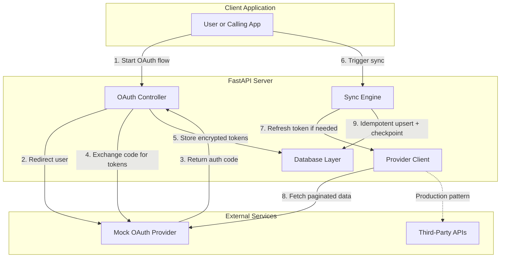

# OAuth Sync Lab


A Python/FastAPI integration lab that demonstrates the mechanics behind reliable OAuth-backed API synchronization: token exchange and refresh, rate-limit-aware pagination, retry handling, resumable sync state, and idempotent persistence.

The implementation is framed as a reusable integration pattern rather than a domain-specific product. Financial APIs are one possible use case, but the same sync approach applies to CRM, SaaS, commerce, and other third-party API integrations.

## Skills Demonstrated

Backend Engineering • OAuth2 Integration • API Reliability • Retry/Backoff Design • Data Sync Patterns • Test-Driven Development

Python • FastAPI • SQLAlchemy • OAuth2 • REST APIs • Pytest • GitHub Actions • CI/CD

## Architecture



## What This Project Actually Shows

### OAuth token refresh and rotation handling

- Authorization-code flow with provider redirect/callback handling
- Server-side storage of encrypted access and refresh tokens
- Automatic access-token refresh when the provider returns `401`
- Refresh-token replacement support when a new refresh token is returned
- Time-bound OAuth state validation to reduce CSRF risk

### Rate-limit-aware request sync

- Cursor-based pagination for multi-page sync jobs
- `429` handling via `Retry-After` parsing
- Exponential backoff across repeated rate-limit responses
- Sync checkpoints stored between pages so progress can resume cleanly

### Retry and error handling logic

- Retry loop scoped to provider rate limiting
- Immediate retry after successful token refresh
- Clear failure when max rate-limit retries are exceeded
- Idempotent transaction upserts to avoid duplicate records after retries

## Quick Start

### Prerequisites

- Python 3.12+
- `pip` 23.0+

### Installation (Windows PowerShell)

```powershell
# 1. Clone and navigate
git clone https://github.com/bentley-michael/oauth-sync-lab.git
cd oauth-sync-lab

# 2. Create virtual environment
py -3.12 -m venv .venv
.\.venv\Scripts\Activate.ps1

# 3. Install dependencies
python -m pip install -U pip
pip install -e .

# 4. Start the server
uvicorn app.main:app --reload
```

API docs: http://127.0.0.1:8000/docs

### Run the demo

```powershell
python scripts/demo_sync.py
```

The demo exercises the full flow:

1. Start OAuth connect
2. Simulate provider authorization
3. Exchange the authorization code for tokens
4. Run a first sync
5. Run a second sync to demonstrate idempotency
6. Run a sync path that triggers a rate-limit retry
7. Inspect stored transactions

## Testing

```bash
python -m pytest -v
python -m pytest tests/test_oauth.py -v
python -m pytest -v -s
```

Current tests verify:

- OAuth state creation and callback flow
- Expired OAuth state handling
- Token persistence behavior through the connect flow

## Project Structure

```text
oauth-sync-lab/
├── app/
│   ├── main.py                 # FastAPI application and routes
│   ├── sync.py                 # Sync engine with refresh/retry logic
│   ├── provider_client.py      # Outbound provider client
│   ├── provider_mock.py        # Built-in mock OAuth/data provider
│   ├── models.py               # SQLAlchemy ORM models
│   └── db.py                   # Database session management
├── scripts/
│   └── demo_sync.py            # End-to-end local demonstration
├── tests/
│   └── test_oauth.py           # OAuth flow tests
├── .github/workflows/
│   └── ci.yml                  # GitHub Actions pipeline
└── pyproject.toml              # Project dependencies and metadata
```

## Design Decisions

### Why cursor-based pagination?

Cursor-based pagination is more stable than offset pagination for sync jobs where upstream data may change during retrieval.

### Why exponential backoff?

When a provider responds with `429`, exponential backoff reduces repeated pressure on the API and spaces out retries in a way that is safer for shared integrations.

### Why idempotent upserts?

Retries are only useful if they do not create duplicates. The sync path checks for an existing provider transaction ID before insert and updates the stored record when the item already exists.

## Security Notes

- OAuth tokens are encrypted before persistence.
- `TOKEN_KEY` should be managed and rotated through a proper secret-management system in production.
- OAuth state values are time-bound and validated on callback.
- Secrets and raw token values should never be logged.
- HTTPS/TLS should be enforced in any real deployment.

## Production Considerations

This repo is a focused lab for integration mechanics, not a full production deployment. In production, the same patterns would typically be extended with:

| Component | Lab Approach | Production Approach |
| --- | --- | --- |
| Secrets | Environment variables | Secret manager or vault |
| Database | SQLite | PostgreSQL or another managed database |
| OAuth state | SQLite with TTL field | Shared cache/store with TTL |
| Sync locking | Single-process behavior | Distributed lock or queue |
| Observability | App logging | Metrics, tracing, alerting |
| Error handling | Retry/backoff | Circuit breakers, DLQs, replay tooling |

## Example Use Cases

- Financial account aggregation and transaction sync
- CRM record ingestion
- Commerce order reconciliation
- Analytics or event backfill jobs
- Any OAuth-backed third-party API that must be polled or synchronized safely

## License

MIT License
